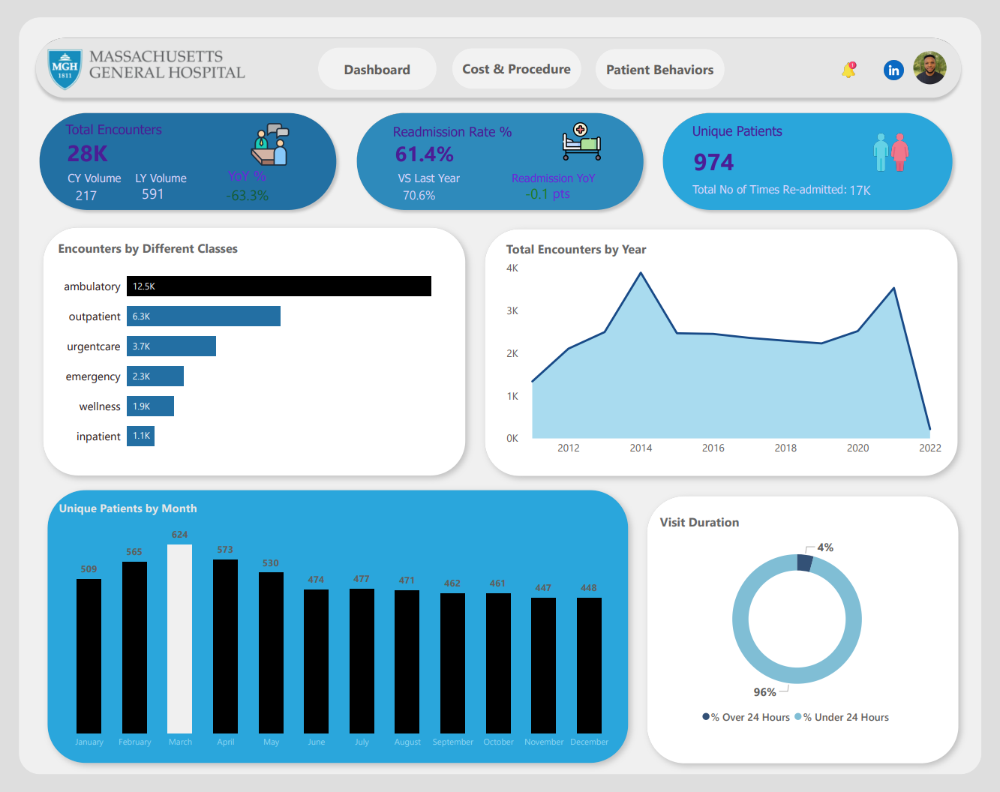
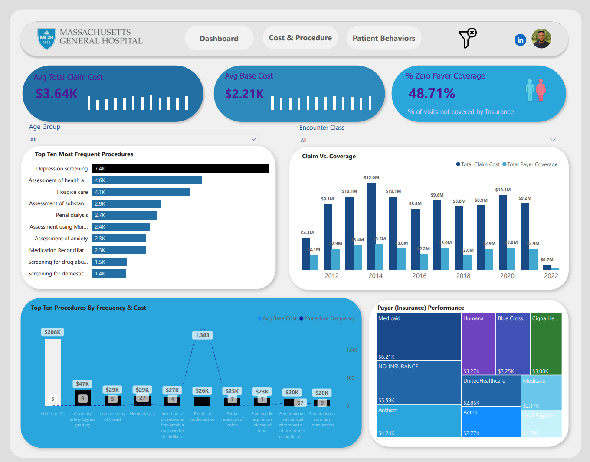
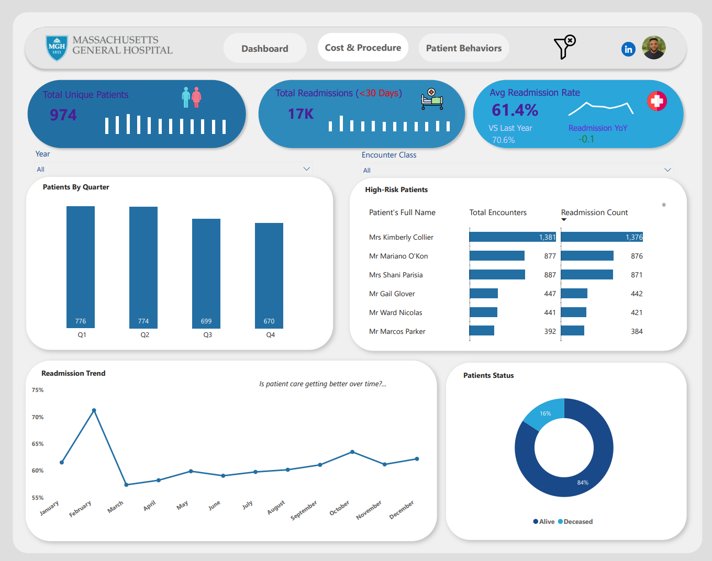

# Massachusetts General Hospital: 10-Year Clinical & Financial Analysis
Transforming 28,000 Patient Records into Actionable Healthcare Strategy (Selected period: 2011–2022)

## 📌 Executive Summary
This project takes a close look at how Massachusetts General Hospital is doing both in its day-to-day operations and its finances. I used ten years' worth of made-up patient data to create a detailed Power BI report. This report connects three important areas: how well patients are cared for (like readmissions), how busy the hospital is (the number of patient visits), and how financially stable it is (gaps in insurance coverage).

## Live Links
- 🔗 [Interactive Dashboard (Power BI Service)](https://app.powerbi.com/view?r=eyJrIjoiZWMwOTdjNzYtYzczNy00MzY1LTgzOGYtNjRmM2U2OGRjYzI0IiwidCI6ImY1MmYyMTgzLTlmNjctNGFkMi1iNjU2LTZmNzU0ZmUxOTZjYiIsImMiOjZ9)
- 📝 [Full Project Article](https://adeniranolanrewaju.medium.com/decade-of-care-an-operational-deep-dive-into-massachusetts-general-hospital-data-2011-2022-2adb97a727bb)

## 🛠️ My Technical Stack and Project Overview
  1. **Data Source**: 1,000 Patient records (2011–2022) curated by the amazing experts at Maven Analytics.
  2. **SQL**: Complex querying for data validation, 30-day readmission logic, and cost aggregations.
  3. **Power BI (DAX)**: Advanced time-intelligence (YOY, YTD), dynamic filtering, and custom KPI development.
  4. **Data Modeling**: Star Schema architecture to optimize report performance.

# Let's Walkthrough the Report Quickly📊

### Page 1: Executive Encounters Overview
Focus: Operational Efficiency

**Key Insight**: While the hospital handled 28k encounters, 96% of stays were under 24 hours. By identifying the 4% outlier "Long Stays," administrators can optimize bed-turnover rates.

**Tech Highlight**: Implemented a CY vs LY Volume measure to track hospital growth trends in real-time.

### Page 2: Financial & Procedure Insights
Focus: Revenue Cycle Management

**Key Insight**: Discovered a 48.71% Coverage Gap where insurance paid $0. Medicaid was identified as the largest payer partner ($6.21K in total claims averagely).

**Cost vs. Frequency**: I created a dual-axis chart proving that high-volume procedures like "Electrical Cardioversion" are more significant revenue drivers than one-off high-cost ICU admissions.

### Page 3: Patient Behavior & Outcomes
Focus: Clinical Quality

**Key Insight**: The hospital maintains a 61.4% average readmission rate. To address this, I built a High-Risk Patient Tracker to identify specific individuals for proactive follow-up care.

**Tech Highlight**: I developed complex DAX logic to flag patients returning within exactly 30 days of their last discharge.

## Business Logic: Revealed with SQL & DAX
To ensure data integrity, I addressed several key business questions:

  1. **Readmission Logic**: How many patients returned within 30 days?
  2. **Financial Gaps**: Which payers have the highest average claim-to-coverage ratio?
  3. **Temporal Trends**: How has unique patient volume fluctuated quarterly over 11 years?

## 🚀 Key Takeaways & Impact
These are the main impacts and proposed solution resulting from this analysis for Massachussets General Hospital.

1. **Reduced Revenue Leakage**: With the help of the "Zero Coverage" encounter's calculation and the insights gotten from this key business metric, the hospital can improve its pre-authorization processes especially invoving payers (Insurance).
2. **Improved Quality of Care**: The Readmission Dashboard allows clinicians to move from reactive to proactive care for high-frequency patients.
3. **Streamlined Operations**: Clear visibility into encounter classes (Ambulatory vs. Emergency) helps in staffing-level adjustments.

## 📬Let's Connect!
About Me:
I'm Kehinde, a Data/Business Analyst passionate about turning messy data into clear business roadmaps.

[LinkedIn](https://www.linkedin.com/in/adeniran-olanrewaju/)
[Email](adeniranolanrewajuu@gmail.com)
